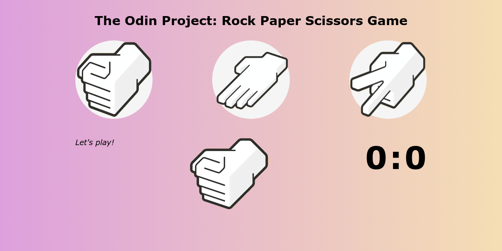

# odin-rock-paper-scissors
A simple implementation of the "Rock Paper Scissors" game in the browser focusing on the use of JavaScript.

I learned how to manipulate the DOM using JavaScript querySelector() and dabbled in some Event-Driven Programming with Event Listeners to integrate DOM Manipulations with user actions.

Another important concept I finally learned was Immediately Invoked Function Expressions (IIFEs) and Function Expressions in JavaScript. I also learned about how Arrays and Array-like Objects worked in JavaScript together with the document object for scanning the HTML file in order to do DOM Manipulation.

I also learned how to do background-image: linear-gradient(direction, color1, color2); to add a sweet linear gradient background. This linear-gradient value can also be applied to other objects, which I'll be excited to try out in future projects.

I need to practice;
- using IIFEs to shorten my code and not make "dangling functions" that are only used once.
- CSS BEM naming standardizations & avoiding certain JavaScript "code smells" for cleaner code
- more event types for more user interaction

# Output
### [Visit the Website Here](https://luzefiru.github.io/odin-rock-paper-scissors/)

# Requirements
These were the requirements in The Odin Project's [Project: Rock Paper Scissors](https://www.theodinproject.com/lessons/foundations-revisiting-rock-paper-scissors) site to initially be followed and to be optionally edited later.
